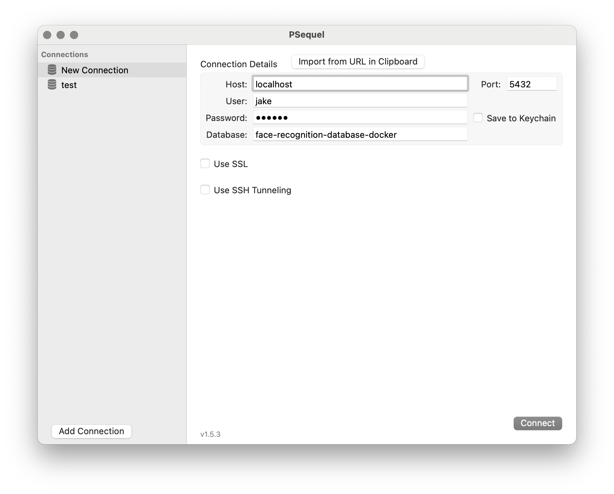

# Face Recognition A.I.: React, Code Analysis, Docker, PostgreSQL, Redis, Cookies, and JWT

## Coding project from the Udemy Course [the Complete Junior to Senior Web Developer Roadmap (2020)](https://www.udemy.com/course/the-complete-junior-to-senior-web-developer-roadmap/)
This application takes images as input and detects multiple faces using a machine-learning API as output.
- I wrote the code in docker-compose.yml and each Dockerfile. I went beyond the instrcutor's project scope by incorporating the front end into the development Docker container.
- I refactored the application from create-react-app to Next.js. I went beyond the instrcutor's project scope by deciding to migrate this application to Next.js.

## 💡 Lessons Learned
- Conventional Commits: standardized messages for git commits
- Code Analysis: working with legacy codebases and refactoring
- Refactoring and migrating create-react-app to Next.js
- Client Side Rendering (CSR) vs Server Side Rendering (SSR)
- Next.js `Link` component for client-side rendering
- Next.js shared components for reducing duplication of code among pages
- Next.js `getServerSideProps` for API calls
- Dockerfile and `docker` CLI commands
- docker-compose.yml and `docker-compose` CLI commands to orchestrate services during development
- PostgreSQL in Docker: creating postgres directory with Dockerfile and `CREATE TABLE` commands in login.sql and users.sql to generate sql tables in Docker container
- Redis CLI commands
- Redis data types: key:value pairs, hashes, linked lists, sets, and sorted-sets 
- Cookies vs. Tokens
- Token-based authentication and session with JSON Web Tokens (JWT) using the [jsonwebtoken](https://github.com/auth0/node-jsonwebtoken) library and Redis
- Redis in Docker
- [Reactstrap](https://github.com/reactstrap/reactstrap) for styling

## 🤔 Senior Software Engineer Considerations
- ### Client Side Rendering (CSR) vs Server Side Rendering (SSR)
  - #### CSR
    - Files are sent from the server to the client without any rendering (like downloading and executing javascript)
    - Once files are processed, some subsequent requests don't need to make another request to the server because it's already downloaded
  - #### SSR
    - A fully-rendered page is sent from the server to the client. Javascript is downloaded and executed in the background
  - #### Benefits of CSR:
    - Easing load on the servers results in faster responses from the server
    - Snappier user experience once the website is loaded
    - Native-like application since there are no full page reloads
    - (Possible drawback as well) Depending on the user's device and internet connection, can be faster than the server
    - Great for large applications since the server's CPU doesn't hold up the event loop
  - #### Benefits of SSR:
    - Faster initial loading
    - Optimizing search engine optimization (SEO)
    - Great for static sites with text
  - #### SSR React Libraries
    - Next.js: optimal for dynamic applications. The 'work' happens on the server
    - Gatsby.js: optimal for static text-based websites. The 'work' happens on the developer's machine
  
- ### Monolithic vs Microservices Architectures
  - In a monolithic architecture, _everything_ (the database, the back-end API, the front-end client, etc.) is housed on a single server.
  - In a microservices architecture, services are split among servers, often in such a way that there is one service per server.

- ### Docker
  - #### Why use Docker?:
    - Docker is solution that ensures that developers all work in the same **development** environment such that the version number of libraries, dependencies, operating systems, etc. are all the same. This decreases the time spent on on-boarding new team members and debugging merged code conflicts due to different development environments.
  - #### What Came Before Docker?
    - Before Docker, there were virtualized machines, such as VMware or VirtualBox. Virtual Machines were like having multiple computers (with thier own operating system, kernel, virtual hardware, and software) nested within a master computer. All of these nested computers caused slower runtimes in development and production.
  - #### What is Docker?:
    - Docker utilizes the idea of containers. Containers are a light-weight option compared to virtual machines since they leverage the host operating system. Removing the redundancy of operating systems unlocks faster runtimes.
      - **Containers**: use the host operating system to generate an isolated environment and to run services defined in an Image.
      - **Image**: is a file with instructions for the container to run certain operations, such as "install Node.js, install dependencies, and then run this application". [DockerHub](https://hub.docker.com/search?q=&type=image) is a good resource for boilerplate Docker Images
    - Docker is also a solution that allows time-efficient horizontal scalability of services on **production** servers since Docker Images can be replicated quickly.

- ### Redis
  - Is a popular NoSQL database for key:values. Other popular NoSQL databases include cassandra for wide column, neo4j for graph, and mongoDB for document.
  - It is an in-memory database for that is ideal for small, short-lived, non-critical data. Having the database in memory makes queries very fast, but also means that data loss is more likely.
  - It is often used for caching small data

- ### Cookies vs Tokens
  - Session management and authentication are expected in every application. Users shouldn't have to sign in again after refreshing the page and users shouldn't have access to other user's data.
  - #### Cookies:
    - A cookie is simply a random string
    - The browser sends a POST request to the server with valid login data, a cookie is generated by the server and given to the browser through the Set-Cookie header along with the server response. When the browser sends another request to the server, it also sends along the cookie. The server validates that it generated this cookie (find and deserialize session) and then sends the response to the browser.
    - This method is **stateful**, meaning that _both_ the browser and the server must store the cookie in memory.
    - Cookie-based authentication has been the standard for a long time
  - #### Tokens:
    - A token is a random string and contains encrypted data within that string
    - The browser sends a POST request to the server with valid login data, a JSON Web Token (JWT) is generated by the server and given to the browser along with the server response. The browser stores this JWT in either session storage or global storage. When the browser sends another request to the server, it also sends along an Authorization Header with Bearer JWT. The servers validates the token using logic (using the `.verify` method) and sends the response to the browser.
    - This method is **stateless**. Unlike cookie-based authentication, the server _doesn't_ need to store the token in memory.
    - Unlike cookie-based authentication, you can use the same JWT across different APIs from the same website. For example, JWT can support native platforms in iOS or Android _and_ websites.
    - One major drawback of using JWTs is decreased security since anyone who intercepts the JWT can decode it (avoid storing sensitive data in a JWT).
    - Token-based authentication has gained popularity over recent years and is particularly well-suited for single-page applications

## 🚀 Getting Started
### To run this project on your system:
1. You must add your own API key to connect to Clarifai API. You can grab a Clarifai API key [here](https://www.clarifai.com/)
  - Option A (recommended). Create a .env file in Back_End and add your API key after `CLARIFAI_KEY=`
  - Option B. Add your API key as a string by replacing `process.env.CLARIFAI_KEY` in line 5 of `Back_End/controllers/image.js`
2. Make sure you have [Docker](https://docs.docker.com/get-docker/) installed and running on your computer
3. Make sure you have [PostgreSQL](https://www.postgresql.org/download/) installed and running on your computer. If you installed PostgreSQL with [Homebrew](https://brew.sh/), then you can start PostgreSQL with `brew services start postgresql`
4. In your terminal, navigate to the root of this repository and run `docker-compose up` (you will have to run `docker-compose up --build` for the first setup phase)
5. Copy and paste this address http://localhost:3001/ or [click here](http://localhost:3001/) to view the application

**⚠️ Important:** if you are getting conflict errors, you should run `docker stop <container name>` that is already running in the background.  
**⚠️ Important:** if you are getting other errors, you should run `docker-compose down` to bring everything down, and start over.  

### To contribute to this project on your system:
- In your terminal, navigate to the root folder of this repository and run `npm install`
- To make git commits, run `npm run commit` to ensure your commit follows the [Conventional Commits](https://www.conventionalcommits.org/en/v1.0.0/) guidelines

### To access the Docker services on your system:
- To access the back-end-api service bash, run `docker-compose exec Back_End bash` while container is up and running in the background
- To access the postgres service via the CLI, run  `psql postgres://<username>:<password>@localhost:5432/smart-brain` (adjust PORT number if needed)
- Alternatively, to access the postgres service with a GUI application like [PSeqeul](http://www.psequel.com/):
  - 
- To access the redis service, run `docker-compose exec redis redis-cli`

## 📝 Lecture Notes
- ### Dockerfile and Docker CLI commands
  - `docker build -t name_of_container .` to create the container
  - `docker run -it name_of_container` to access the shell of the container
  - `docker run -it -d name_of_container` to run container in background and `docker exec -it container_id_hash bash` to access the bash of the container
  - `docker stop container_id_hash` to stop the container
  - `docker ps` to print read-out of containers running
  - `docker run -it -p 3000:3001 name_of_container` for port forwarding. The `-p` stands for port, `3000` represents the port of the container, and `3001` represents the port on your local machine. You can now visit [localhost:3001](http://localhost:3001)
- ### Docker-Compose CLI commands
  - `docker-compose up --build` to create the container
  - `docker-compose up -d` to run container in background and `docker-compose exec name_of_container bash` to access the bash of the container
  - `docker-compose down` to stop all services
- ### Redis CLI commands
  - `redis-server` to initialize server and `redis-cli` to access the command line interface
  - `SET name_of_key value` to create a key:value pair and `MSET name_of_key value ...` to create multiple key:value pairs
  - `GET name_of_key` to retrieve the value and `MGET name_of_key value ...` to retrieve multiple values
  - `EXISTS name_of_key` to check the existenence of the key
  - `DEL name_of_key` to delete the key:value pair
  - `HSET name_of_field name_of_key value ...` to create a hash field and `HGET name_of_field name_of_key` to retrieve value
  - `LPUSH name_of_linked_list value` to add node to to the left and `RPUSH name_of_linked_list value` to add node to to the right
  - `LRANGE name_of_linked_list start stop` to retrieve the the values of the linked list from the specified start to the specified end
  - `LTRIM name_of_linked_list start stop` to delete nodes from the specified start to the specified end and `RPOP name_of_linked_list` to delete the rightmost node
  - `SADD name_of_set values ...` to create an unordered set of values. Sets do not allow for repeated values.
  - `SMEMBERS name_of_set` to retrieve the the values of the set
  - `SISMEMBER name_of_set value` to check the existenence of the value within the set
  - `ZADD name_of_key value_of_score name_of_member` to add a score and a member to a set of values ordered least to greatest.
  - `ZRANGE name_of_key start stop` to retrieve the the members of the set from the specified start to the specified end and to display them in ascending order.
  - `ZRANK name_of_key name_of_member` to retrieve the rank of the specified member within the ordered set.

## 📣 Reference
- Section 8: SPA vs Server Side Rendering, Section 10: Code Analysis, Section 11: Docker, Section 12: Redis, Section 13: Sessions + JWT of the Udemy Course [the Web Developer Bootcamp](https://www.udemy.com/course/the-web-developer-bootcamp/)